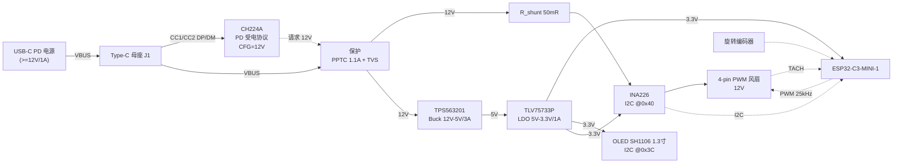

# 桌面 PWM 智能风扇 —— 完整技术方案

> 版本：v1.0　日期：2026-08-28
> 关键词：USB-C PD 受电 / CH224A / TPS563201 / TLV75733P / INA226 / ESP32-C3 / 4-pin PWM 风扇

---

## 目录

1. [项目定义与指标](#1-项目定义与指标)
2. [开工前必须确认的两件事](#2-开工前必须确认的两件事)
3. [系统框图与电源树](#3-系统框图与电源树)
4. [模块详细设计](#4-模块详细设计)
   - [4.1 USB-C PD 受电（CH224A）](#41-usb-c-pd-受电ch224a)
   - [4.2 12V → 5V 降压（TPS563201）](#42-12v--5v-降压tps563201ddcr)
   - [4.3 5V → 3.3V LDO（TLV75733P）](#43-5v--33v-ldotlv75733pdbvr)
   - [4.4 电压电流检测（INA226）](#44-电压电流检测ina226aidgsr)
   - [4.5 风扇驱动与测速](#45-风扇驱动与测速)
   - [4.6 MCU 与引脚分配](#46-mcuesp32-c3-与引脚分配)
   - [4.7 显示与人机交互](#47-显示与人机交互)
   - [4.8 保护与调试口](#48-保护电路与调试口)
5. [功耗预算](#5-功耗预算)
6. [完整 BOM](#6-完整-bom)
7. [关键网络连接表](#7-关键网络连接表原理图检查用)
8. [PCB 布局布线要点](#8-pcb-布局布线要点)
9. [固件设计](#9-固件设计)
10. [上电调试步骤](#10-上电调试步骤bring-up)
11. [机械结构](#11-机械结构)
12. [风险清单与待确认项](#12-风险清单与待确认项)
13. [后续扩展方向](#13-后续扩展方向)

---

## 1. 项目定义与指标

一台桌面风扇，通过 USB-C PD 取 12V 供电，MCU 用 25kHz PWM 调速，实时采集风扇电压/电流/功率/转速并显示在外接屏上。

| 项目 | 指标 |
|---|---|
| 输入 | USB Type-C，PD 3.0 受电，固定请求 12V |
| 输入功率 | ≤ 12W（建议电源 ≥ 12V/1A） |
| 风扇 | 12V 4-pin PWM 风扇（Intel 4-Wire 标准），120mm |
| 调速 | 25kHz PWM，占空比 0–100%，可选转速闭环 |
| 测量 | 风扇支路电压（0–36V，1.25mV LSB）、电流（±1.6A，50µA LSB）、功率 |
| 测速 | TACH 脉冲计数，2 脉冲/转，精度 ±30 RPM |
| 显示 | 外接 **1.3" SH1106 OLED 模块**（I²C，128×64，地址 0x3C） |
| 交互 | 旋转编码器（带按键）+ BOOT 键 |
| MCU | ESP32-C3（模块 ESP32-C3-MINI-1），预留 Wi-Fi 控制 |
| 板尺寸 | 建议 55 × 40 mm，2 层板（1oz 铜）即可 |

---

## 2. 开工前必须确认的两件事

这两点会直接决定 PCB 能不能一版过，务必打板前处理。

> **已确认的前提**（无需再核）：
> - 所用充电头支持 **12V PD 固定档**
> - CH224A 用电阻配置模式硬件固定 12V：**CFG1 → 24kΩ → GND**，CFG2/CFG3 悬空
> - TPS563201 的 **Vref = 0.768V**
> - TPS563201 的 **EN 为 VIN 耐压**（推荐 −0.1~17V，绝对最大 −0.3~19V），直接接 VBUS

### 2.1 Buck 的本地输入电容（当前原理图缺失）

TPS563201 的 VIN 引脚旁边**必须**有 `10µF/25V ×2 + 100nF/50V`，物理上紧贴 VIN 和 GND 脚。

Type-C 座旁边那颗 10µF **不能替代它** —— 网络上虽然是同一个 VBUS，但开关电流的高频回路是 `Cin(+) → VIN → GND → Cin(−)`，这个环路必须压到几毫米以内。

缺了会出现三个后果：

1. VIN 引脚上出现电压尖峰，有可能顶到 **19V 绝对最大值**打坏芯片
2. 严重的传导与辐射 EMI
3. 输入纹波灌回 CH224A，干扰 PD 协商

这是整块板上**唯一一处"少一颗电容就可能烧片"**的地方，而且原理图检查时极容易漏掉，因为网络连接看起来是对的。

### 2.2 LDO 的热耗

TLV75733P 在 5V → 3.3V 下每 100mA 耗散 0.17W，SOT-23-5 的 θJA ≈ 200°C/W。详细计算见 §4.3，结论是**平均功耗没问题，但要给足铜箔**；如果打算让 Wi-Fi 长时间满功率发射，需按 §4.3 的优化建议调整。

---

## 3. 系统框图与电源树



**电源树（含裕量）**

```
USB-C VBUS ──► 12V @ 1A max ──┬──► 风扇支路      12V, 0.25A 典型 / 0.45A 启动
                               ├──► TPS563201 ──► 5V @3A ──┬─► TLV75733P ─► 3.3V @1A ─┬─► ESP32-C3  0.10A 典型 / 0.40A 峰值
                               │                            │                          ├─► OLED       0.015A
                               │                            │                          ├─► INA226     0.4mA
                               │                            │                          └─► 上拉/编码器 <1mA
                               │                            └─► 5V 外设预留（排针）
                               └──► CH224A 自供电（内部 LDO）  ~1mA
```

---

## 4. 模块详细设计

### 4.1 USB-C PD 受电（CH224A）

**作用**：作为 Sink 端协议芯片，通过 CC 线与电源协商，把 VBUS 从默认 5V 拉到 12V。

**连接要点**

**封装**：10 引脚 SOP，**无散热焊盘（EP）**，GND 为普通引脚。

| Pin | 名称 | 连接 | 说明 |
|:---:|---|---|---|
| 1 | `VHV` | **直接接 VBUS，无需串限流电阻** | 高压供电输入，就近放 **1µF + 100nF** 去耦 |
| 2 | `CFG2/SCL` | 悬空 | 电阻配置模式下不用；I²C 配置模式下为 SCL |
| 3 | `CFG3/SDA` | 悬空 | 同上，I²C 模式下为 SDA |
| 4 | `DP` | Type-C D+ | 用于 QC/BC1.2 协商；只用 PD 时可悬空 |
| 5 | `DM` | Type-C D− | 同上 |
| 6 | `CC2` | Type-C B5 | **直连，不加 5.1kΩ 下拉** —— Rd 由芯片内部提供 |
| 7 | `CC1` | Type-C A5 | 同上；CC1/CC2 必须独立走线，不能并联 |
| 8 | `VBUS` | VBUS | 总线电压检测 |
| 9 | `CFG1` | **24kΩ → GND** | 电阻配置，选定请求电压（本设计 = 12V） |
| 10 | `PG` | → MCU GPIO3（10kΩ 上拉到 3.3V） | 开漏输出，协商成功后拉低；同时串 1kΩ 点一颗绿色 LED。固件用它判断"12V 是否到位" |
| — | `GND` | 地 | **普通引脚，非散热焊盘**；引脚号见原理图符号 |

> **无 EP 不影响散热**：CH224A 只做 CC 线协议协商，不通过 VBUS 大电流，静态功耗约 1mA（≈12mW），没有热耗散需求。GND 引脚旁打 2 个过孔直连地平面即可，那是为了信号完整性而不是散热。

**CFG1 电阻配置**

CH224A 通过 CFG1 上一颗到地的电阻来选择请求电压，本设计用 **R1 = 24kΩ 对应 12V**。

> **24kΩ = 12V 已对照 CH224A 数据手册确认。** 其余档位（9V/15V/20V）的阻值查同一张表。
>
> 注意 CH224 系列不同型号（CH224A / CH224K / CH224D）的封装、引脚序号和配置方式都不一致 —— 有的是 CFG1/2/3 三态组合，有的是单电阻编程。**换型号必须重新查表**。

**另一种配置方式**：CFG2/CFG3 复用为 I²C（SCL/SDA），可由 MCU 在运行时改请求电压。本设计不用，两脚悬空。

**Type-C 母座选型**：16P 贴片母座（如 TYPE-C-31-M-12 或同类 16PIN 沉板式）。Sink 端只需引出 `VBUS ×4`（并联加流）、`GND ×4`、`CC1`、`CC2`、`D+`、`D−`；SBU1/SBU2 悬空。

---

### 4.2 12V → 5V 降压（TPS563201DDCR）

**器件特性**：4.5–17V 输入，0.76–7V 输出，3A，580kHz 固定频率，D-CAP2 控制（支持全陶瓷输出电容，无需外部斜坡注入），SOT-23-6（DDC）封装，`VFB = 0.768V ±1%`。

**引脚定义（SOT-23-6 / DDC）**

| Pin | 名称 | 连接 |
|:---:|---|---|
| 1 | `GND` | 地（Cin / Cout 的地就近汇于此） |
| 2 | `SW` | → L1 → 5V 输出；同时接 Cbst 的一端 |
| 3 | `VIN` | 12V；**Cin 必须紧贴本脚与 Pin1** |
| 4 | `VFB` | R1/R2 分压中点（从 Cout 正端取样） |
| 5 | `EN` | 直接接 VBUS（VIN 耐压，无需分压） |
| 6 | `VBST` | 经 100nF 到 Pin2 (SW) |

**输出电压设定**

```
Vout = VFB × (1 + R1/R2)

取 R2 = 10.0kΩ (1%)：
R1 = 10k × (5.0/0.768 − 1) = 55.10kΩ（理论值）

E96 标准值只有 54.9k 和 56.2k，没有 55.1k：
  R1 = 54.9kΩ  →  Vout = 0.768 × 6.49 = 4.98V
  R1 = 56.2kΩ  →  Vout = 0.768 × 6.62 = 5.08V
E24 简化：R1 = 56kΩ  →  Vout = 0.768 × 6.60 = 5.07V  ← 本设计采用（与原理图一致）

5.07V 对下游没有影响：TLV75733P 输入上限 5.5V，5V 外设也在容差内。
想更接近 5.00V 就换 54.9kΩ，两者都可以。
```

**EN 引脚接法**

TPS563201 的 EN 是 **VIN 耐压**的：Recommended Operating Conditions 为 **−0.1 ~ 17V**，Absolute Maximum Ratings 为 **−0.3 ~ 19V**。所以**可以直接接到 12V VIN，不需要分压**。

```
VIN(12V) ──[ R3 = 100kΩ ]──┬── EN
                            │
                        [ R4：不贴 ]   ← 可选位，用于设定输入 UVLO
                            │
                           GND
```

- **本设计 EN 直接走线接到 VBUS**，不装 R3。R3 只是一个可选的串阻位：留一颗 100kΩ 能在热插拔浪涌时给 EN 的内部钳位限流，属于锦上添花，不装也没问题。
- **本设计不装 R4**：我们希望 VBUS 只有 5V 时（只插调试口、或 PD 协商完成前）Buck 依然工作，好让 MCU 起来报状态。装了 UVLO 反而会挡住这个行为。
- 若将来想加输入欠压锁定（比如低于 9V 就关断），装上 R4：`Vin_on = V_EN_th × (R3 + R4) / R4`，V_EN_th 约 1.2V；取 R4 = 15kΩ → `Vin_on ≈ 9.2V`。

> 为什么不用 CH224A 的 PG 直接控制 EN：PG 是"协商成功拉低"，逻辑正好反了；而且**希望 MCU 在 VBUS 只有 5V 时（协商完成前、或只插调试口时）也能启动**，好在屏幕上报状态。所以 Buck 常开，风扇的通断交给固件控制 PWM / 高边开关。

**外围元件选型**

| 元件 | 值 | 封装/规格 | 说明 |
|---|---|---|---|
| L1 | 4.7µH | 屏蔽功率电感，Isat ≥ 4A，DCR ≤ 40mΩ（如 SPM6530 系列） | 纹波电流 ΔI ≈ 1.07A |
| Cin | 10µF/25V ×2 + 100nF/50V | 1206 X7R + 0402 | **必须紧贴 VIN–GND**，回路面积最小 |
| Cout | 22µF/25V ×2 + 100nF | 1206 X7R | 选 25V 是为了减小直流偏压降容 |
| Cbst | 100nF/25V | 0402 X7R | VBST ↔ SW 之间 |
| Cff | 10–33pF（可选，预留焊盘） | 0402 | 并在 R1 两端，改善瞬态 |
| Cbulk | 100µF/25V 固态电容 | 靠近风扇接口 | 吸收风扇启动浪涌 |

**纹波与损耗计算**

```
电感纹波：ΔIL = Vout × (Vin − Vout) / (Vin × L × fsw)
              = 5 × (12 − 5) / (12 × 4.7µH × 580kHz) = 1.07A   （满载 3A 时约 36%，合理）

输出纹波：ΔVout ≈ ΔIL / (8 × fsw × Cout)
              = 1.07 / (8 × 580k × 22µF) ≈ 10.5mV   （实际含 ESR，约 20–30mVpp）

实际负载仅约 0.4A，效率 ≈ 88%，芯片耗散 < 0.15W，SOT-23-6 完全够用。
```

> **陶瓷电容直流偏压效应**：22µF/16V 0805 在 5V 偏压下有效容值可能只剩 10µF 左右。用 **1206 封装 / 25V 耐压**可把降容控制在 20% 以内。这直接影响 D-CAP2 环路稳定性，别省这个面积。

> 上表脚位已按 TI 数据手册确认。原理图与 PCB 对照时按引脚号逐个核对，尤其别把 EN(5) 和 VFB(4) 接反 —— 那样芯片永远不会启动。

---

### 4.3 5V → 3.3V LDO（TLV75733PDBVR）

**器件特性**：1A 低压差 LDO，固定 3.3V 输出，Vin 1.4–5.5V，典型压差约 175mV @1A，PSRR 高，SOT-23-5（DBV）封装。

**引脚定义（SOT-23-5 / DBV）**

| Pin | 名称 | 连接 |
|:---:|---|---|
| 1 | `IN` | 5V（Cin 紧贴） |
| 2 | `GND` | 地 |
| 3 | `EN` | 直接接 IN（常开） |
| 4 | `NC` | **空脚，不接**（固定输出版本无 NR 噪声旁路功能） |
| 5 | `OUT` | 3.3V（Cout 紧贴） |

**外围**

| 元件 | 值 | 位置 |
|---|---|---|
| Cin | 1µF/16V X7R 0603 | 紧贴 IN 脚 |
| Cout | 10µF/16V X7R 0805 | 紧贴 OUT 脚 |
| C_bulk | 22µF/10V + 100nF | 紧贴 ESP32-C3 模块的 3V3 引脚（吸收 Wi-Fi 发射电流突变） |
| EN | 直接接 IN（常开） | 若要低功耗休眠，可引到 MCU |

> Pin 4 是 **NC**，直接悬空即可，**不要接地也不要接电容**。有些同系列器件这一脚是 NR（噪声旁路，需外接 10nF 到地），照抄那种电路会引入不必要的元件；反过来若在 NC 脚接地，某些封装内部可能与衬底相连，属于未定义行为。

**热分析（重要）**

```
Pd = (Vin − Vout) × Iout = 1.7 × Iout

Iout = 100mA（Wi-Fi 连接态平均）  ：Pd = 0.17W
Iout = 150mA（含 OLED 由 3.3V 供）：Pd = 0.26W
Iout = 400mA（Wi-Fi 发射瞬时峰值）：Pd = 0.68W

SOT-23-5，θJA ≈ 200°C/W（1 平方英寸铺铜可降到约 165°C/W）

稳态 0.26W → ΔTj ≈ 43–52°C → Tj ≈ 70–80°C @25°C 环境       ✔ 可接受
瞬时 0.68W → 稳态换算 ΔTj ≈ 112°C（Tj 约 137°C，逼近 150°C 上限）
            但 Wi-Fi 发射是毫秒级脉冲，封装热时间常数远大于脉宽，实测不会到这个温度。
```

**结论与优化建议**

1. **必做**：LDO 的 GND 焊盘和 OUT 铜箔各铺 ≥ 100mm²，打 4–6 个 0.3mm 过孔到底层地平面。
2. 固件把 Wi-Fi 发射功率限到 **15dBm**（`esp_wifi_set_max_tx_power(60)`），峰值电流从约 400mA 降到约 250mA，耗散直接砍掉 40%。
3. **如果打算长时间跑 Wi-Fi 高负载**，二选一：
   - 换 **SON-6 / SOT-223 封装**的 3.3V LDO（如 TLV75733PDRVR），θJA 能降一半 —— 推荐这条；
   - 或在确定不用 5V 外设的前提下，把 Buck 输出改成 **3.6V**（R1 改 37.4kΩ / R2 10kΩ → 3.64V），LDO 耗散降到 0.045W。
4. 你原路线（12V→5V→3.3V 两级）在**当前负载下是成立的**，上面只是边界条件，不必改。

---

### 4.4 电压电流检测（INA226AIDGSR）

**器件特性**：16 位 Σ-Δ ADC，双向电流/功率监测，`VS = 2.7–5.5V`，**共模输入范围 −0.3 ~ +36V**（12V 完全够），分流电压满量程 ±81.92mV / LSB 2.5µV，总线电压 0–36V / LSB 1.25mV，I²C 最高 2.94MHz，VSSOP-10（DGS）封装。

**接线拓扑（高边采样，只测风扇支路）**

```
        R_shunt = 50mΩ
12V ────[■■■■]────┬──────► 风扇 +12V (接口 Pin2)
     │         │   │
   IN+       IN−  VBUS   ← 注意 VBUS 引脚接在负载侧，测的是"实际加到风扇上的电压"
     └────┬────┘
       INA226   VS ← 3.3V（100nF + 1µF 去耦）
                A0=GND, A1=GND  →  I²C 地址 0x40
                SDA/SCL → MCU GPIO4/GPIO5
                ALERT   → 不接（改 I²C 轮询，GPIO10 让给编码器 B 相）
```

**采样电阻与标定计算**

```
最大预期电流 Imax = 1.5A（120mm 风扇启动峰值留足裕量）
R_shunt = 50mΩ（1%，1206 或 2512 封装，≥0.25W）

满量程：81.92mV / 50mΩ = 1.638A            ✔ 覆盖 1.5A
Current_LSB = 1.5 / 32768 = 45.8µA          → 取整 50µA/bit

CAL = 0.00512 / (Current_LSB × R_shunt)
    = 0.00512 / (50e-6 × 0.05) = 2048 = 0x0800

Power_LSB = 25 × Current_LSB = 1.25 mW/bit
Bus_LSB   = 1.25 mV/bit（固定）

典型工况：风扇 0.25A → 分流压降 12.5mV，采样电阻耗散 3.1mW（可忽略）
分辨率 50µA，对 0.25A 而言相对精度 0.02%，远超需求
```

**寄存器配置**

| 寄存器 | 地址 | 值 | 含义 |
|---|---|---|---|
| Configuration | `0x00` | `0x4527` | AVG=16，VBUSCT=1.1ms，VSHCT=1.1ms，模式=分流+总线连续 |
| Calibration | `0x05` | `0x0800` | CAL = 2048 |
| Manufacturer ID | `0xFE` | 读应为 `0x5449` | 通信自检 |
| Die ID | `0xFF` | 读应为 `0x2260` | 通信自检 |

```
Config 位域：0x4000 | (AVG<<9) | (VBUSCT<<6) | (VSHCT<<3) | MODE
           = 0x4000 | (2<<9) | (4<<6) | (4<<3) | 7 = 0x4527
单次转换周期 = 16 × (1.1ms + 1.1ms) = 35.2ms  → 约 28 次/秒刷新，够用
```

**读数换算**

```c
current_A = (int16_t) reg(0x04) * 50e-6f;     // 电流
bus_V     = (uint16_t)reg(0x02) * 1.25e-3f;   // 风扇端电压
power_W   = (uint16_t)reg(0x03) * 1.25e-3f;   // 芯片内部算好的功率
shunt_V   = (int16_t) reg(0x01) * 2.5e-6f;    // 调试用
```

**抗干扰**

- IN+ / IN− 各串 **10Ω**，两脚之间并 **100nF**（差分 RC 滤波，截止约 80kHz），滤掉风扇内部换相尖峰。
- 采样电阻必须用 **Kelvin（开尔文）四线连接**：IN+/IN− 从电阻焊盘的内侧引出，走差分平行线，不要从大电流铜箔上"顺手接一下"。
- 若改用 2 线风扇 + 低边斩波（§4.5 备选方案），电流是断续的，读数会剧烈跳动。届时需要把 AVG 提到 512，或把采样电阻挪到 Buck 之前测总输入电流。**这是选 4 线风扇的又一个理由。**

---

### 4.5 风扇驱动与测速

#### 首选：4-pin PWM 风扇（Intel 4-Wire 标准）

风扇一直接 12V 常电，转速由独立的 PWM 控制脚决定，TACH 脚输出转速脉冲。

**接口定义（2.54mm 4P 直插排针）**

| Pin | 名称 | 线色（业界惯例） | 连接 |
|:---:|---|---|---|
| 1 | GND | 黑 | 地 |
| 2 | +12V | 黄/红 | INA226 负载侧 |
| 3 | TACH（SENSE） | 绿 | → MCU GPIO7 |
| 4 | PWM（CONTROL） | 蓝 | ← MCU 开漏驱动 |

**PWM 驱动电路（开漏，必须）**

Intel 规范要求主板端用**开漏**驱动，上拉由风扇内部提供（3.3V 或 5V）。ESP32-C3 的 3.3V 推挽输出直接接过去，部分风扇的 VIH 门限判定不可靠。

```
MCU GPIO6 ──[ 1kΩ ]──┬── G ┐
                      │     │ 2N7002 / BSS138 (NMOS)
                  [ 10kΩ ]  D ──── 风扇 Pin4 (PWM)
                      │     │
                     GND    S ──── GND
```

- **逻辑是反的**：GPIO 输出高 → NMOS 导通 → PWM 线被拉低 → **0% 转速**。固件用 LEDC 的 `output_invert` 标志或 `duty = MAX − target` 处理。
- 10kΩ 下拉保证**上电/复位期间 NMOS 关断 → 风扇满速运行**，这是安全的默认状态。
- 可选：在漏极加 10kΩ 上拉到 5V，兼容个别没有内部上拉的风扇（Intel 规范上限 5.25V，安全）。

**频率**：Intel 规范 21–28kHz，取 **25kHz**。低于 20kHz 会有可闻啸叫。

**TACH 测速电路**

```
风扇 Pin3 ──┬──[ 1kΩ ]──┬── MCU GPIO7
            │            │
        [ 10kΩ ]      [ 1nF ]
            │            │
          3.3V          GND
```

- 风扇内部是开集电极输出，**必须外部上拉**（10kΩ 到 3.3V）。
- 1kΩ + 1nF 组成低通（fc ≈ 160kHz），滤高频毛刺。
- **2 脉冲/转**（标准）：`RPM = 脉冲数 × 60 / (2 × 窗口秒数)`；取 0.5s 窗口时正好 `RPM = 脉冲数 × 60`。

**最低占空比**：绝大多数 4 线风扇在 duty < 20% 时会失速停转，且部分风扇 duty = 0% 时是**满速**（规范未定义此行为）。固件必须：

- 设置 `DUTY_MIN = 20%` 下限；
- 需要停转时，用"占空比拉到 0% + 高边负载开关断电"，或直接切断 12V。

**可选：12V 高边负载开关**（真正断电用）

```
12V ──┬── S ┐
      │     │ AO3401 (P-MOS)
   [ 100kΩ ]│ D ── 风扇 12V
      │     G
      └─────┴──[ 10kΩ ]── D ┐
                             │ 2N7002
                             S ── GND
                             G ← MCU GPIO（高电平 = 给风扇通电）
```

#### 备选：2-pin 直流风扇 + 低边斩波

仅在手头只有 2 线风扇时用：

```
风扇+ ── 12V
风扇− ──┬── D ┐
        │     │ AO3400 (NMOS, Rds(on) < 50mΩ)
     [ SS34 ] S ── GND
        │     G ←[ 100Ω ]── MCU GPIO6，栅极 10kΩ 下拉
   （SS34 续流二极管：阴极接 12V，阳极接风扇−）
```

代价：**没有 TACH，测不了转速**（你的需求明确要显示转速，所以不推荐）；电流断续导致 INA226 读数抖动；风扇内部驱动被斩波可能工作异常。

---

### 4.6 MCU（ESP32-C3）与引脚分配

**选型**：**ESP32-C3-MINI-1**（内置 4MB Flash，板载 PCB 天线）。相比裸片省掉晶振、Flash、射频匹配的调试工作量，对首版极其友好。

模块对外可用 GPIO：**GPIO0–GPIO10、GPIO18–GPIO21**（GPIO11–17 已用于内部 Flash）。

**引脚分配表**

| GPIO | 功能 | 方向 | 备注 |
|:---:|---|:---:|---|
| 0 | NTC / 备用 ADC | AI | ADC1_CH0，预留温控 |
| 1 | **编码器 A 相** | DI | 10kΩ 上拉 + 100nF 滤波，**双边沿中断** |
| 2 | **编码器按键 SW** | DI | ⚠️ **Strapping 脚**，10kΩ 上拉 + 100nF，保证启动时为高；50ms 轮询即可 |
| 3 | PD_PG（CH224A PG） | DI | 10kΩ 上拉，低电平 = 12V 已协商成功 |
| 4 | I²C SDA | DIO | 4.7kΩ 上拉到 3.3V |
| 5 | I²C SCL | DO | 4.7kΩ 上拉到 3.3V |
| 6 | FAN_PWM | DO | LEDC 25kHz → NMOS 栅极 |
| 7 | FAN_TACH | DI | 上升沿中断 |
| 8 | 状态 LED | DO | **Strapping 脚**，10kΩ 上拉，LED 低电平点亮 |
| 9 | BOOT 按键 | DI | **Strapping 脚**，10kΩ 上拉 + 按键到地 |
| 10 | **编码器 B 相** | DI | 10kΩ 上拉 + 100nF 滤波，**双边沿中断** |
| 18 | **空闲（预留）** | — | 原 USB D−。留测试焊盘，将来可接 USB-JTAG |
| 19 | **空闲（预留）** | — | 原 USB D+。留测试焊盘，将来可接 USB-JTAG |
| 20 | UART0_RX | DI | J5.Pin3 → TTL 的 TXD；**烧录与日志的唯一通路** |
| 21 | UART0_TX | DO | J5.Pin2 → TTL 的 RXD |

**Strapping 引脚硬性约束（必须遵守）**

- **GPIO2 和 GPIO8 上电瞬间必须为高电平**，否则芯片进不了正常启动模式 → 两者都必须有 10kΩ 上拉，且**不能接强下拉负载**。
- **GPIO9 上电时为低 = 进入下载模式**，所以 BOOT 键必须是"常开 + 上拉"。
- 状态 LED 接在 GPIO8 上时，务必接成**低电平点亮**（GPIO8 → LED 阴极，LED 阳极 → 1kΩ → 3.3V），这样上电默认高电平、LED 灭，不破坏 strapping。

**启动模式真值表**

| GPIO2 | GPIO8 | GPIO9 | 模式 |
|:---:|:---:|:---:|---|
| 1 | × | 1 | **SPI Boot** —— 正常运行 |
| 1 | 1 | 0 | **Download Boot** —— 烧录模式 |
| 0 | × | × | 非法组合，芯片起不来 |

**模块 EN（复位）电路 —— 必需，不能省**

ESP32-C3-MINI-1 的 `EN` 引脚是芯片复位输入，**必须外接延时 RC**，否则 3.3V 上升过程中芯片可能在电源未稳时就释放复位，出现随机启动失败。

```
3.3V ──[ R22 = 10kΩ ]──┬── U5.EN
                        │
                   [ C26 = 1µF ]
                        │
                       GND
                        │
              SW2 (RESET 按键) ── U5.EN 到 GND
```

- RC 时间常数 10ms，保证 EN 在 3.3V 稳定后才拉高
- **C26 必须紧贴模块的 EN 脚**
- SW2 是复位按键。配合 BOOT 键手动进下载模式（见 §9.4）。装了自动复位电路后日常不用它，但**固件跑飞时它是唯一退路**，务必保留

**EC11 旋转编码器接线**

EC11 共 5 脚：编码器侧 A / C / B，按键侧 2 脚。C 为公共端接地。

```
A ──┬── GPIO1        C ── GND        B ──┬── GPIO10
  [10kΩ]                               [10kΩ]
    │                                    │
   3.3V                                 3.3V
  [100nF] 到地                         [100nF] 到地

按键 ──┬── GPIO2      另一端 ── GND
     [10kΩ]
       │
      3.3V
     [100nF] 到地
```

| 编码器 | GPIO | 上拉 | 滤波 | 采样方式 |
|---|:---:|---|---|---|
| A 相 | 1 | 10kΩ | 100nF 到地 | **双边沿中断** |
| B 相 | 10 | 10kΩ | 100nF 到地 | **双边沿中断** |
| 按键 | 2 | 10kΩ | 100nF 到地 | 50ms 轮询 |

> ⚠️ **A 相和 B 相绝对不能放到 GPIO2 / GPIO8 / GPIO9**。编码器停在哪一格是随机的，某些定位点上 A 或 B 就是低电平 —— 那样上电必然进不了正常启动模式，这是**必然故障**而不是偶发故障。
>
> 按键放 GPIO2 是可以的：用户一般不会按着旋钮上电；真按住了也只是进下载模式，和 BOOT 键行为一致，拔插一次就好。

**INA226 的 ALERT 不接**，改用 I²C 轮询（200ms 一次，而 INA226 转换周期只有 35ms，完全跟得上）。ALERT 在这个场景没有价值 —— 它能提前几十毫秒告警，但风扇过流是秒级过程。省下 GPIO10 给编码器 B 相。

> **引脚预算结论**：C3 可用 IO 仅 15 个，扣掉 USB/UART/strapping 后余量很紧。**因此显示屏必须走 I²C（只占 2 根，且与 INA226 共用总线）**，不要选 SPI TFT（需 4–6 根，会把 UART 控制台、PD_PG、NTC 全部挤掉）。若一定要彩屏，请换 ESP32-S3-MINI-1。

---

### 4.7 显示与人机交互

**选定方案：1.3" SH1106 OLED 模块（I²C，128×64，0x3C）**

| 方案 | 型号 | 接口 | 增量 GPIO | 分辨率 | 评价 |
|---|---|---|:---:|---|---|
| **本设计** | **SH1106 1.3" OLED 模块** | I²C | **0** | 128×64 | 与 INA226 共用总线，不额外占引脚；1.3" 比 0.96" 显示面积大约 40%，大号转速字高约 9.5mm，坐姿距离一眼可读 |
| 备选 | SSD1306 0.96" OLED 模块 | I²C | 0 | 128×64 | 便宜五块钱，但字偏小，靠后一点就吃力 |
| 不采用 | ST7789 1.3" IPS 彩屏 | SPI | 4 | 240×240 | 需 SCLK/MOSI/DC/BL 四根，会把 C3 的引脚用光（UART 控制台、PD_PG、ALERT、NTC 全部要让位）。监控仪表用不上彩色 |
| 不采用 | SSD1331/SSD1351 彩色 OLED | SPI | 3 | 96×64 / 128×128 | 自发光省掉背光线，但常亮仪表盘的固定字符会**烧屏**，且价格是 ST7789 的 2–4 倍 |

> **为什么 I²C OLED 是 0 增量引脚**：I²C 把器件寻址（7 位地址）和数据/命令标志（控制字节 0x00/0x40）都放在协议内部，所以不需要 CS 和 DC 两根物理线；OLED 自发光，也不需要背光线。而 SDA/SCL 这两根本来就要为 INA226 拉出来，OLED 是白搭车。代价是带宽只有 400kHz —— 但 128×64 单色满屏只有 1024 字节，刷一帧约 23ms，够 40fps，远超仪表盘需要的 5fps。

**外接接口 J4**：4P 2.54mm 排针（或 XH2.54 更牢固）

```
Pin1: 3V3    Pin2: GND    Pin3: SDA(GPIO4)    Pin4: SCL(GPIO5)
```

> ⚠️ **排针顺序要按实际买到的模块丝印定**。市面上 1.3" SH1106 模块常见两种排法：`GND VCC SCL SDA`（最常见）和 `VCC GND SCL SDA`。**VCC 与 GND 对调有可能烧模块**。稳妥做法：J4 按上表画，用 4P 杜邦线转接（线序随意对）；或者确定型号后按丝印调整 J4 顺序。

**采购确认三件事**

1. **买模块，不要买裸屏**。裸屏（30pin 0.5mm FPC）需要你自己搭电荷泵（2 组飞跨电容 + VCC 储能电容）、IREF 亮度电阻、接口模式选择脚（BS0/1/2 按规格书接 VDD 或 VSS）、多组去耦，约 10–12 颗被动件加一个细间距 FPC 座，而且这些参数随面板厂不同而不同，必须找卖家要规格书。成本几乎不省，纯增风险。
2. **确认是 I²C 版（4 脚）**，不是 SPI 版（7 脚）。有些模块用 R1/R2/R3 跳线电阻切换，买错要改焊。
3. **确认驱动是 SH1106**。SSD1306 本身没有 1.3" 规格，所以标着"1.3 寸 SSD1306"的实物基本都是 SH1106；但要避开 SSD1309（同为 128×64，驱动不同）。

**外观处理**：模块尺寸约 35×33mm。把它装在前面板开窗的**后面**，玻璃朝外贴住面板内侧，正面只看得到玻璃和显示内容，视觉效果和裸屏没有区别，只是外壳厚 3–4mm。

**I²C 总线**：400kHz，SDA/SCL 各一个 4.7kΩ 上拉到 3.3V（两个从机 + 排线电容，4.7kΩ 合适；排线较长可降到 2.2kΩ）。

**UI 布局草图（128×64 OLED）**

```
┌────────────────────────────┐
│ 12.02V      0.243A   [WiFi]│  ← 电压 / 电流 / 联网图标
│                            │
│      1 8 4 0   RPM         │  ← 大号转速
│                            │
│ 2.92W   ████████░░  65%    │  ← 功率 / 占空比条
│ MODE: AUTO      27.4°C     │  ← 模式 / 温度（可选）
└────────────────────────────┘
```

**交互逻辑**

| 操作 | 行为 |
|---|---|
| 旋转编码器 | 调节目标占空比 / 目标转速（步进 5%） |
| 短按 | 切换模式：手动 → 自动温控 → 静音 → 全速 |
| 长按 2s | 风扇开 / 关 |
| 双击 | 切换显示页（实时数据 / 统计 / 网络信息） |
| BOOT + 上电 | 进入烧录模式 |

设置项（目标转速、模式、亮度）存 **NVS**，掉电保持。

---

### 4.8 保护电路与调试口

**输入保护（按 VBUS 顺序）**

```
Type-C VBUS ──[ PPTC 1.1A/30V ]──┬──[ 磁珠 600Ω@100MHz ]── 12V 内部轨
                                  │
                            [ TVS SMAJ15A ]
                                  │
                                 GND
```

**顺序很重要**：PPTC 在前、TVS 在后。TVS 的失效模式是短路，放在保险丝之后才能被保护；反过来一旦 TVS 击穿就是一条无保护的对地通路。

| 器件 | 规格 | 作用 |
|---|---|---|
| PPTC 自恢复保险丝 | **保持 1.1A / 跳闸 2.2A / 耐压 ≥30V**，1206 或 1812（MF-MSMF110、1206L110、0ZCJ0110） | 持续过载 / 短路保护 |
| TVS | SMAJ15A（15V 关断，24.4V 钳位） | 浪涌 / 热插拔尖峰 |
| ESD 二极管 | CC1/CC2/DP/DM 各一颗 ESD9B5.0ST5G。四根线都只进 CH224A（5V 域），不直连 MCU，用 5V 标称即可 | 静电防护 |

**PPTC 选型依据**：整机 12V 侧最大正常电流约 0.6A（风扇启动瞬间 + 其余负载）。PPTC 跳闸电流约为保持电流的 2 倍，所以 1.1A/2.2A 既不会误动作，又能在风扇接口插错位、12V 碰地时切断。**不要选 2A 保持** —— 那要 4A 以上才动作，等于没装。注意 PPTC 保持电流随温度降额，封闭外壳内 50°C 时 1.1A 约剩 0.85A。耐压选 30V 而非 16V：耐压只在跳闸瞬间起作用（全压加在它两端），30V 与 16V 同价但能扛住协商异常给到 20V 的情况。

> **别对保险丝抱错期望**：PPTC 响应是秒级的，保护不了芯片。真正拦住快速故障的是 PD 电源自身的 OCP（最快）和 TPS563201 的逐周期限流 + 打嗝保护。PPTC 的职责是防止持续过载导致过热起火，属于最后一道兜底。

> **TVS 选型注意**：SMAJ15A 的钳位电压 24.4V 高于 TPS563201 的绝对最大 VIN（约 20V）。该钳位值只在大能量浪涌时出现，静电/热插拔场景够用；若追求严谨可选 **SMBJ13A**（钳位 21.5V），或在 Buck 输入前加一颗 16V 稳压管。

> **PD 浪涌限制**：USB PD 规范对 Sink 端在协商前的 VBUS 电容量有限制（通常建议 ≤ 10µF），电容太大会触发电源过流保护导致反复重启。所以：**VBUS 输入端只放 10µF**，那颗 100µF 的 bulk 电容放在**风扇支路**（采样电阻之后），可串一个 1Ω 电阻做软启动。

**单 Type-C 口 + UART 烧录（本方案）**

板上只有一个 Type-C 座 J1，**它只做供电，不做数据**。烧录和串口一律走 J5 的 UART 排针 + 外部 USB-TTL 模块。

```
J1 (Type-C 16P) —— 纯供电口
├── VBUS ×4 ──── F1 → FB1 → 12V 内部轨
├── GND  ×4 ──── GND
├── CC1 (A5) ─── CH224A CC1 (Pin7)     ← PD 协商只走 CC
├── CC2 (B5) ─── CH224A CC2 (Pin6)
├── D+ (A6/B6) ─ CH224A DP (Pin4)      ← 保留给 QC/BC1.2
└── D− (A7/B7) ─ CH224A DM (Pin5)

J5 (2.54mm 4P) —— 烧录 + 串口，与供电口完全独立
```

**这样分工的好处：调试体验反而更好**

TTL 通路和供电口互不相干，所以 **PD 插着、风扇满速运转的同时，串口日志照样在刷** —— 调 PI 参数、抓堵转误判、看编码器有没有丢步，都能拿到实时现场。如果把 Type-C 拿去做 USB 数据，就必须"拔 PD 才能连电脑"，风扇运行时反而是瞎的。

另外 **GPIO18/19 空出来了**（原生 USB 不用了）。板上留一对测试焊盘引出来即可，将来若需要断点调试，飞一个 USB 座上去就能用 C3 内建的 USB-JTAG。

**J5 引脚定义（4P）—— 配四脚 CH340 模块**

| Pin | 名称 | 接 CH340 模块的 |
|:---:|---|---|
| 1 | 3V3 | **不接** |
| 2 | GND | GND |
| 3 | TXD (GPIO21) | 模块的 **RXD** |
| 4 | RXD (GPIO20) | 模块的 **TXD** |

**TX/RX 必须交叉**：板子的 TXD 接模块的 RXD。接成同名对同名是"完全烧不进、报错还毫无指向性"的第一大原因。

> ⚠️ **Pin1 的 3V3 常态下不要接**。板子由 Type-C 供电，再从 CH340 模块灌一路电进来，两个电源顶在一起会互相倒灌。这一脚只在"完全不插 Type-C、纯靠模块供电"时才用（此时风扇不转，仅够 MCU 跑），两种供电方式**绝不能同时**。
>
> 把 Pin1 放在排针最外侧、丝印标清楚，防止顺手插错。

**不做硬件自动复位**

市面上便宜的 CH340 模块只引出 `VCC/GND/TX/RX`，没有 DTR/RTS，所以经典的两管自动复位电路用不上，本设计**不做**。进入下载模式靠两条路：

1. **手动按键**（默认）：按住 BOOT → 点 RESET → 松开 BOOT。就两个动作。
2. **软件命令**（推荐，见下）：固件自己重启进下载模式，连按键都不用。

BOOT 和 RESET 按键**无论如何都要保留** —— 它们是默认工作流的主路，也是固件跑飞时的唯一退路。

**让固件自己进下载模式**

C3 有个 RTC 寄存器位可以强制下一次复位进 ROM 下载模式：

```c
#include "soc/rtc_cntl_reg.h"

// 收到串口魔术命令（例如 "reboot_bl\n"）时调用
void enter_download_mode(void)
{
    REG_WRITE(RTC_CNTL_OPTION1_REG, RTC_CNTL_FORCE_DOWNLOAD_BOOT);
    esp_restart();
}
```

烧录流程变成：**串口发一条命令 → 芯片自己重启进下载 → 直接跑 esptool**，不碰按键。

代价是它依赖"当前固件还活着"。固件跑飞了仍然只能按键 —— 所以按键还是得留。

> **第一版固件里先验证这个寄存器位**：调用后看 esptool 能不能连上，能连上就说明真的进了下载模式。不同 IDF 版本宏名可能有差异，找不到就去 `components/soc/esp32c3/include/soc/rtc_cntl_reg.h` 里搜 `FORCE_DOWNLOAD_BOOT`。

---

## 5. 功耗预算

| 负载 | 电压轨 | 典型电流 | 峰值电流 | 典型功率 |
|---|---|---:|---:|---:|
| 120mm PWM 风扇（100%） | 12V | 250 mA | 450 mA（启动） | 3.00 W |
| ESP32-C3（Wi-Fi 连接态） | 3.3V | 100 mA | 400 mA | 0.33 W |
| SH1106 1.3" OLED | 3.3V | 20 mA | 30 mA（全白） | 0.07 W |
| INA226 | 3.3V | 0.4 mA | 0.4 mA | 1.3 mW |
| CH224A | 12V | ~1 mA | — | 12 mW |
| 上拉 / LED / 编码器 | 3.3V | ~5 mA | — | 17 mW |
| **3.3V 轨小计** | | **120 mA** | 430 mA | **0.40 W** |
| **5V 轨小计**（经 LDO） | | 120 mA | 430 mA | 0.60 W |
| **12V 输入合计**（Buck η=88%） | | **~308 mA** | ~600 mA | **3.70 W** |

**电源要求**：12V / 1A（12W）即有 3 倍裕量。建议选**标称 18W 以上且带 12V 档**的 PD 充电器。

---

## 6. 完整 BOM

### 主要 IC

| 位号 | 型号 | 封装 | 数量 | 说明 |
|---|---|---|:---:|---|
| U1 | CH224A | 见数据手册 | 1 | USB PD 受电协议 |
| U2 | TPS563201DDCR | SOT-23-6 | 1 | Buck 12V→5V/3A |
| U3 | TLV75733PDBVR | SOT-23-5 | 1 | LDO 5V→3.3V/1A |
| U4 | INA226AIDGSR | VSSOP-10 | 1 | 电压/电流/功率监测 |
| U5 | ESP32-C3-MINI-1 | 模块 | 1 | MCU（4MB Flash） |

### 分立器件

| 位号 | 型号/参数 | 封装 | 数量 | 说明 |
|---|---|---|:---:|---|
| L1 | 4.7µH / Isat≥4A / DCR≤40mΩ | 6.5×6.5mm 屏蔽 | 1 | Buck 电感 |
| Rs1 | 50mΩ ±1% / ≥0.25W | 1206 或 2512 | 1 | 电流采样，选低温漂型 |
| Q1 | 2N7002 或 BSS138 | SOT-23 | 1 | PWM 开漏驱动 |
| Q2 | AO3401（P-MOS，可选） | SOT-23 | 1 | 12V 高边负载开关 |
| Q3 | 2N7002（可选） | SOT-23 | 1 | Q2 的驱动 |
| D1–D4 | ESD9B5.0ST5G | SOD-923 | 4 | CC1/CC2/DP/DM ESD（均为 5V 域，不接 MCU） |
| TVS1 | SMAJ15A | SMA | 1 | 输入浪涌 |
| F1 | PPTC 保持 1.1A / 跳闸 2.2A / ≥30V | 1206 或 1812 | 1 | 自恢复保险丝，选型依据见 §4.8 |
| FB1 | 磁珠 600Ω@100MHz / 2A | 0805 | 1 | 输入滤波 |
| LED1 | 绿色 | 0805 | 1 | PD 12V 指示 |
| LED2 | 蓝色 | 0805 | 1 | 状态指示（GPIO8） |

### 电阻（1%，0402/0603）

| 位号 | 阻值 | 数量 | 用途 |
|---|---|:---:|---|
| R1 | 56kΩ（E24；或 54.9kΩ E96） | 1 | Buck 反馈上分压 → Vout = 5.07V（或 4.98V） |
| R2 | 10.0kΩ | 1 | Buck 反馈下分压 |
| R3 | 走线直连（不装元件） | 0 | VBUS → EN；可选留 100kΩ 焊盘作浪涌限流 |
| R4 | 15kΩ（**不贴**，预留位） | 0 | 可选输入 UVLO 下分压 |
| R5, R6 | 4.7kΩ | 2 | I²C 上拉 |
| R7–R13 | 10kΩ | 7 | 上拉：GPIO2(编码器键)、GPIO8(LED)、GPIO9(BOOT)、PG、TACH、编码器 A、编码器 B |
| R14, R15 | 10Ω | 2 | INA226 输入滤波 |
| R16 | 1kΩ | 1 | TACH 串阻 |
| R17 | 1kΩ | 1 | Q1 栅极串阻 |
| R18 | 10kΩ | 1 | Q1 栅极下拉 |
| R19 | 24kΩ ±1% | 1 | CFG1 配置电阻 → GND（12V 档，已对手册确认） |
| R20, R21 | 1kΩ | 2 | LED 限流 |
| R22 | 10kΩ | 1 | 模块 EN 上拉（复位 RC） |

### 电容

| 位号 | 参数 | 封装 | 数量 | 用途 |
|---|---|---|:---:|---|
| C1, C2 | 10µF / 25V X7R | 1206 | 2 | Buck 输入 |
| C3, C4 | 22µF / 25V X7R | 1206 | 2 | Buck 输出 |
| C5 | 100nF / 25V X7R | 0402 | 1 | Bootstrap |
| C6 | 10–33pF（可选） | 0402 | 1 | 前馈电容（预留） |
| C7 | 1µF / 16V X7R | 0603 | 1 | LDO 输入 |
| C8 | 10µF / 16V X7R | 0805 | 1 | LDO 输出 |
| C9 | 22µF / 10V X5R | 0805 | 1 | ESP32 模块去耦 |
| C10 | 100µF / 25V 固态 | 6.3×6.3 | 1 | 风扇支路 bulk |
| C11 | 100nF | 0603 | 1 | INA226 差分滤波 |
| C12–C20 | 100nF / 50V X7R | 0402 | 9 | 各 IC 去耦 |
| C21 | 1µF | 0603 | 1 | CH224A VHV 去耦 |
| C22–C24 | 100nF | 0402 | 3 | 编码器 A / B / 按键 RC 滤波（配 10kΩ 上拉，τ = 1ms） |
| C25 | 1nF | 0402 | 1 | TACH 滤波（配 1kΩ 串阻，fc ≈ 160kHz） |
| C26 | 1µF | 0603 | 1 | 模块 EN 复位 RC，**必须紧贴 EN 脚** |

### 连接器与结构件

| 位号 | 型号 | 数量 | 说明 |
|---|---|:---:|---|
| J1 | Type-C 16P 母座（沉板） | 1 | **纯供电口**，不做数据 |
| J3 | 2.54mm 4P 直针 | 1 | 风扇接口 |
| J4 | 2.54mm 4P 直针 | 1 | OLED（顺序按实际模块丝印，见 §4.7） |
| J5 | 2.54mm 4P 直针 | 1 | **烧录 + 串口唯一通路**：3V3/GND/TXD/RXD，配四脚 CH340，见 §4.8 |
| ENC1 | EC11 旋转编码器（带按键） | 1 | 交互 |
| SW1 | 6×6 轻触开关 | 1 | BOOT（GPIO9） |
| SW2 | 6×6 轻触开关 | 1 | RESET（模块 EN 到地） |

### 外购模块

| 型号 | 数量 | 说明 |
|---|:---:|---|
| **SH1106 1.3" OLED 模块（I²C 4 脚）** | 1 | 128×64，地址 0x3C，3.3V 供电，模块尺寸约 35×33mm。**买模块不买裸屏**；确认是 I²C 版而非 SPI 版；确认驱动是 SH1106 而非 SSD1309。约 ¥15 |
| 120mm 4-pin PWM 风扇 | 1 | 见 §11 选型表 |
| 4P 杜邦线（母-母） | 1 | 接 OLED，可规避排针顺序不匹配 |

---

## 7. 关键网络连接表（原理图检查用）

打板前照着这张表逐条打勾。

| 网络名 | 起点 | 终点 | 检查要点 |
|---|---|---|---|
| `VBUS_IN` | J1.VBUS (A4/A9/B4/B9) | F1 → FB1 → `V12` | 4 个 VBUS 引脚全部并联 |
| `V12` | FB1 输出 | Rs1、U2.VIN、U1.VHV、U1.VBUS、TVS1 | TVS 和 Cin 就近 |
| `CC1` | J1.A5 | U1.CC1 | **不加 5.1k 下拉** |
| `CC2` | J1.B5 | U1.CC2 | 独立走线，不与 CC1 并联 |
| `CFG1` | U1.Pin9 | R19（24kΩ）→ GND | 选定 12V；CFG2/CFG3(Pin2/3) 悬空 |
| `PD_PG` | U1.PG | 10kΩ→3V3、MCU.GPIO3、LED1 | 开漏，低有效 |
| `V12_FAN` | Rs1 另一端 | J3.Pin2、U4.VBUS、C10 | INA226 的 VBUS 接负载侧 |
| `INA_IN+` | Rs1 电源侧焊盘 | R14 → U4.IN+ | **Kelvin 连接** |
| `INA_IN−` | Rs1 负载侧焊盘 | R15 → U4.IN− | **Kelvin 连接**，与 IN+ 平行走线 |
| `SW` | U2.SW | L1 | 铜箔面积尽量小 |
| `V5` | L1 另一端 | C3/C4、R1、U3.IN | |
| `FB` | R1/R2 中点 | U2.VFB | 从 C4 正端取样，远离 SW |
| `EN_BUCK` | V12 经 R3 | U2.EN | EN 为 VIN 耐压（≤17V），实测 ≈ VBUS；R4 位空贴 |
| `V3P3` | U3.OUT | U5.3V3、U4.VS、OLED、所有上拉 | C8/C9 就近 |
| `SDA` | U5.GPIO4 | U4.SDA、J4.Pin3、R5→3V3 | |
| `SCL` | U5.GPIO5 | U4.SCL、J4.Pin4、R6→3V3 | |
| `FAN_PWM_GATE` | U5.GPIO6 | R17 → Q1.G（R18 下拉） | |
| `FAN_PWM` | Q1.D | J3.Pin4 | 开漏，逻辑反相 |
| `FAN_TACH` | J3.Pin3 | R16 → U5.GPIO7；10kΩ→3V3；1nF→GND | |
| `ENC_A` | ENC1.A | U5.GPIO1；10kΩ→3V3；100nF→GND | **不可放 GPIO2/8/9** |
| `ENC_B` | ENC1.B | U5.GPIO10；10kΩ→3V3；100nF→GND | 同上 |
| `ENC_SW` | ENC1 按键 | U5.GPIO2；10kΩ→3V3；100nF→GND | strapping，上电须为高 |
| — | ENC1.C（公共端） | GND | 编码器公共脚接地 |
| `DP` | J1.A6（建议与 B6 短接） | U1.DP (Pin4)；D3 ESD | 只给 CH224A 做 QC/BC1.2，不接 MCU |
| `DM` | J1.A7（建议与 B7 短接） | U1.DM (Pin5)；D4 ESD | 同上 |
| `UART_TX` | U5.GPIO21 | J5.Pin3 | 接 CH340 的 **RXD**（交叉） |
| `UART_RX` | U5.GPIO20 | J5.Pin4 | 接 CH340 的 **TXD**（交叉） |
| — | U5.GPIO18 / GPIO19 | **测试焊盘，预留** | 空闲，将来可接 USB-JTAG |
| `MCU_EN` | R22（10kΩ）→ 3V3 | U5.EN；C26（1µF）→ GND；SW2 → GND | **复位 RC，C26 必须紧贴 EN 脚** |
| `BOOT` | SW1 | U5.GPIO9；10kΩ→3V3 | 常开上拉，按下 = 进下载模式 |
| `GND` | — | 完整地平面 | 功率地与模拟地在 Cin 处单点汇合 |

---

## 8. PCB 布局布线要点

### 8.1 布局分区

```
┌──────────────────────────────────────────────┐
│ [J1 Type-C]  [F1 TVS]  [U1 CH224A]           │  ← 输入 / 协议区
│                                              │
│  ┌── 功率区 ────────────┐  ┌─ 风扇区 ──┐     │
│  │ C1 C2 [U2] L1 C3 C4  │  │ Rs1 [U4]  │     │
│  │      SW 节点最小化    │  │ C10  [J3] │     │
│  └──────────────────────┘  └───────────┘     │
│                                              │
│  [U3 LDO] ─ C8            ┌── 数字区 ──┐     │
│                           │[U5 C3-MINI]│     │
│  [J5 UART] [ENC1] [SW1/2] │ 天线朝板边  │     │
│  [J4 OLED]                └────▲───────┘     │
└────────────────────────────────┴─────────────┘
                             天线禁铺铜区
```

### 8.2 硬性规则

**Buck 部分（最关键）**

1. **输入回路面积最小化**：`Cin(+) → U2.VIN → U2.GND → Cin(−)` 是最大的 EMI 源，Cin 必须紧贴芯片，两颗都放，环路面积压到最小。
2. **SW 节点铜箔尽量小**：只要够载流即可（宽度 ≥ 1mm），面积越大辐射越强。SW 下方**不要走任何信号线**，底层对应区域只铺地。
3. **反馈线远离 SW**：R1/R2 靠近 U2 的 VFB 脚放置，采样点取自 Cout 正极端子；FB 走线走内侧、用地包夹，长度 < 10mm。
4. **VBST 电容**紧贴 VBST 和 SW 引脚。
5. **散热**：VIN 和 SW 焊盘各铺一小块铜（≥ 50mm²），GND 焊盘打 4 个过孔到底层。

**INA226 采样部分**

1. **Kelvin 四线**：IN+/IN− 从采样电阻的**焊盘内侧**引出，不要从大电流铜箔中间接。
2. IN+/IN− 差分平行走线、等长、间距 = 线宽，全程走在完整地平面之上，长度 < 20mm。
3. R14/R15/C11 靠近 INA226 放，不要靠近电阻端。
4. INA226 的 GND 接**模拟地**，单点连到功率地，避开大电流路径。

**大电流走线**

- 12V 主路径（VBUS → 风扇）按 1A 设计，1oz 铜 20°C 温升理论需要 0.35mm，**实际画 ≥ 1.0mm**；过孔用 0.4mm 孔 × 2 个并联。
- Type-C 的 4 个 VBUS 和 4 个 GND 引脚全部并联使用。

**射频部分**

- ESP32-C3-MINI-1 的**天线区域必须悬空**：模块天线正下方及外扩 ≥ 5mm 范围内，**所有层禁止铺铜、禁止走线**，最好让天线伸出板边或对齐板边。
- 模块正下方（非天线区）铺实地并打散热过孔。

**去耦**

- 每颗 IC 的电源脚 100nF 距离 < 2mm，过孔直接下到地平面。
- ESP32 模块的 3V3 脚旁必须有 22µF + 100nF。

### 8.3 叠层

2 层板即可（顶层器件+走线，底层完整地平面 + 少量跨接）。**底层地平面不要被走线切割成孤岛**，尤其是 Buck 和 INA226 下方。若预算允许，4 层（信号 / 地 / 电源 / 信号）更省心。

---

## 9. 固件设计

### 9.1 技术栈

- **框架**：ESP-IDF v5.x（推荐）或 Arduino-ESP32 v3.x
- **外设**：`LEDC`（PWM）、`GPIO ISR + esp_timer`（测速）、`i2c_master`（新驱动）、`NVS`（配置）、`esp_wifi`（可选）
- **显示库**：`u8g2`（ESP-IDF 移植版 / Arduino 原生支持）

> ⚠️ **构造函数必须选 SH1106，不能用 SSD1306** —— 这是这块屏最高频的翻车点。SH1106 内部显存是 **132×64**，可视区只有 **128×64**，起始列有 2 像素偏移。用 SSD1306 的驱动去点它，画面会整体偏移 2 像素、右边缘出现一竖条垃圾。
>
> ```cpp
> U8G2_SH1106_128X64_NONAME_F_HW_I2C u8g2(U8G2_R0, U8X8_PIN_NONE);
> ```
>
> `_F_` 是全帧缓冲（1024 字节 RAM），C3 的 400KB SRAM 完全放得下，用它最省心。

> **ESP32-C3 没有 PCNT（脉冲计数器）外设**（那是 ESP32 / S3 / C6 才有的）。所以 TACH 只能用 **GPIO 中断计数** 或 **RMT RX 捕获**。本方案用中断计数，简单可靠。照抄 ESP32 的 PCNT 代码会编译不过。

### 9.2 任务划分（FreeRTOS）

| 任务 | 周期 | 优先级 | 职责 |
|---|---|:---:|---|
| `task_sensor` | 100ms | 5 | 读 INA226，滑动平均滤波 |
| `task_tach` | 500ms | 5 | 统计脉冲数 → RPM |
| `task_control` | 200ms | 6 | 模式状态机 + PI 闭环 → 更新 PWM |
| `task_ui` | 50ms | 4 | **只做按键状态机**（短按/双击/长按）。编码器走中断，不在这里轮询 |
| `task_display` | 200ms | 3 | 刷新 OLED |
| `task_net` | 事件驱动 | 2 | Wi-Fi / HTTP / MQTT（可选） |

共享数据用一个 `fan_state_t` 结构体 + `portMUX` 或 mutex 保护。

> ⚠️ **编码器不要用轮询**。手快速拨动约 15–20 格/秒，每格 4 次正交跳变 → **每 12–16ms 就有一次跳变**。50ms 轮询会漏掉大半，表现为"转快了不跟手、甚至反向跳"。必须用双边沿 GPIO 中断（见 §9.3）；若因故只能轮询，周期要压到 1–2ms。

### 9.3 关键代码

**PWM 初始化（25kHz，11 位分辨率，硬件反相）**

```c
#include "driver/ledc.h"

#define FAN_PWM_GPIO    6
#define FAN_PWM_FREQ    25000
#define FAN_PWM_RES     LEDC_TIMER_11_BIT   // 2048 级
#define FAN_PWM_MAX     ((1 << 11) - 1)

void fan_pwm_init(void)
{
    // ESP32-C3 只有 LOW_SPEED_MODE
    // 最大分辨率 = log2(80MHz / 25kHz) = 11.6  →  取 11 bit
    ledc_timer_config_t t = {
        .speed_mode      = LEDC_LOW_SPEED_MODE,
        .timer_num       = LEDC_TIMER_0,
        .duty_resolution = FAN_PWM_RES,
        .freq_hz         = FAN_PWM_FREQ,
        .clk_cfg         = LEDC_AUTO_CLK,
    };
    ESP_ERROR_CHECK(ledc_timer_config(&t));

    ledc_channel_config_t c = {
        .speed_mode = LEDC_LOW_SPEED_MODE,
        .channel    = LEDC_CHANNEL_0,
        .timer_sel  = LEDC_TIMER_0,
        .gpio_num   = FAN_PWM_GPIO,
        .duty       = 0,
        .hpoint     = 0,
        .flags.output_invert = 1,   // ★ 补偿 NMOS 开漏驱动的反相
    };
    ESP_ERROR_CHECK(ledc_channel_config(&c));
}

// duty_pct: 0-100
void fan_set_duty(uint8_t duty_pct)
{
    if (duty_pct > 100) duty_pct = 100;
    // 失速保护：大于 0 但低于 20% 时钳到 20%
    if (duty_pct > 0 && duty_pct < 20) duty_pct = 20;

    uint32_t duty = (uint32_t)FAN_PWM_MAX * duty_pct / 100;
    ledc_set_duty(LEDC_LOW_SPEED_MODE, LEDC_CHANNEL_0, duty);
    ledc_update_duty(LEDC_LOW_SPEED_MODE, LEDC_CHANNEL_0);
}
```

**TACH 测速**

```c
#include "driver/gpio.h"
#include "esp_timer.h"

#define FAN_TACH_GPIO       7
#define TACH_PULSES_PER_REV 2
#define TACH_WINDOW_MS      500

static portMUX_TYPE     s_mux     = portMUX_INITIALIZER_UNLOCKED;
static volatile uint32_t s_pulses  = 0;
static volatile int64_t  s_last_us = 0;

static void IRAM_ATTR tach_isr(void *arg)
{
    int64_t now = esp_timer_get_time();
    if (now - s_last_us > 200) {        // 200µs 软件消抖
        s_pulses++;
        s_last_us = now;
    }
}

void tach_init(void)
{
    gpio_config_t io = {
        .pin_bit_mask = 1ULL << FAN_TACH_GPIO,
        .mode         = GPIO_MODE_INPUT,
        .pull_up_en   = GPIO_PULLUP_ENABLE,   // 外部已有 10k，这里再加一道保险
        .intr_type    = GPIO_INTR_POSEDGE,
    };
    gpio_config(&io);
    gpio_install_isr_service(ESP_INTR_FLAG_IRAM);
    gpio_isr_handler_add(FAN_TACH_GPIO, tach_isr, NULL);
}

// 每 500ms 调一次
uint16_t tach_read_rpm(void)
{
    uint32_t p;
    portENTER_CRITICAL(&s_mux);
    p = s_pulses;
    s_pulses = 0;
    portEXIT_CRITICAL(&s_mux);

    // RPM = p * 60 / (PULSES_PER_REV * 窗口秒数) = p * 60 / (2 * 0.5) = p * 60
    return (uint16_t)(p * 60);
}
```

**INA226 驱动**

```c
#define INA226_ADDR       0x40
#define REG_CONFIG        0x00
#define REG_SHUNT_V       0x01
#define REG_BUS_V         0x02
#define REG_POWER         0x03
#define REG_CURRENT       0x04
#define REG_CALIBRATION   0x05
#define REG_MFG_ID        0xFE
#define REG_DIE_ID        0xFF

// R_shunt = 50mR, Current_LSB = 50uA  ->  CAL = 0.00512/(50e-6 * 0.05) = 2048
#define INA226_CAL        2048
#define CURRENT_LSB_A     50e-6f        // 50 uA/bit
#define POWER_LSB_W       1.25e-3f      // 25 * Current_LSB
#define BUS_LSB_V         1.25e-3f      // 固定

esp_err_t ina226_init(void)
{
    uint16_t id;
    ESP_ERROR_CHECK(ina226_read(REG_MFG_ID, &id));
    if (id != 0x5449) {                 // 'TI'
        ESP_LOGE(TAG, "INA226 未找到, MFG_ID=0x%04X", id);
        return ESP_FAIL;
    }
    // AVG=16, VBUSCT=1.1ms, VSHCT=1.1ms, MODE=分流+总线连续
    // 0x4000 | (2<<9) | (4<<6) | (4<<3) | 7 = 0x4527，转换周期 16*2.2ms = 35.2ms
    ESP_ERROR_CHECK(ina226_write(REG_CONFIG,      0x4527));
    ESP_ERROR_CHECK(ina226_write(REG_CALIBRATION, INA226_CAL));
    return ESP_OK;
}

void ina226_measure(float *v, float *i, float *p)
{
    uint16_t raw;
    ina226_read(REG_BUS_V,   &raw);  *v = (uint16_t)raw * BUS_LSB_V;
    ina226_read(REG_CURRENT, &raw);  *i = (int16_t) raw * CURRENT_LSB_A;
    ina226_read(REG_POWER,   &raw);  *p = (uint16_t)raw * POWER_LSB_W;
}
```

**旋转编码器解码（查表状态机 + 双边沿中断）**

不要用"A 下降沿时读 B"那种简单写法 —— 机械触点抖动会让你转一格跳三格。用两位状态查表，非法跳变自动被吃掉：

```c
#define ENC_A   1
#define ENC_B  10

// index = (上一状态 << 2) | 当前状态
// 合法跳变给 ±1，非法跳变（抖动 / 一次跳变两位）给 0，天然抗抖
static const int8_t QDEC[16] = {
     0, -1, +1,  0,
    +1,  0,  0, -1,
    -1,  0,  0, +1,
     0, +1, -1,  0
};

static volatile uint8_t s_prev  = 0b11;   // 定位点：A、B 都被上拉为高
static volatile int8_t  s_accum = 0;

static void IRAM_ATTR enc_isr(void *arg)
{
    uint8_t cur = (gpio_get_level(ENC_A) << 1) | gpio_get_level(ENC_B);
    if (cur == s_prev) return;

    s_accum += QDEC[(s_prev << 2) | cur];
    s_prev   = cur;

    // 只在回到定位点时才产生一格，中间三次跳变只累加不输出
    if (cur == 0b11) {
        if      (s_accum >=  3) enc_post_step(+1);   // 顺时针
        else if (s_accum <= -3) enc_post_step(-1);   // 逆时针
        s_accum = 0;
    }
}

void encoder_init(void)
{
    gpio_config_t io = {
        .pin_bit_mask = (1ULL << ENC_A) | (1ULL << ENC_B),
        .mode         = GPIO_MODE_INPUT,
        .pull_up_en   = GPIO_PULLUP_ENABLE,
        .intr_type    = GPIO_INTR_ANYEDGE,       // ★ 必须双边沿
    };
    gpio_config(&io);
    gpio_isr_handler_add(ENC_A, enc_isr, NULL);
    gpio_isr_handler_add(ENC_B, enc_isr, NULL);
}
```

两个设计要点：

- **只在回到 `0b11` 定位点才计一格**。EC11 转一格（一声"咔"）正好走完一个正交周期 = 4 次跳变，中间过程不输出。这样手指停在两格之间来回晃动不会刷屏。
- **阈值用 `>=3` 而不是 `==4`**，容忍一次漏跳或抖动。触点用旧了以后这一条很救命。

`enc_post_step()` 里不要做重活，把步进量丢进队列交给 `task_control` 处理即可。

**按键状态机（`task_ui`，50ms 轮询足够）**

| 判定 | 条件 | 动作 |
|---|---|---|
| 消抖 | 电平稳定 20ms 才认 | — |
| 短按 | 按下→抬起 < 500ms，且 300ms 内无第二次 | 切换模式 |
| 双击 | 两次短按间隔 < 300ms | 切换显示页 |
| 长按 | 按住 ≥ 2000ms | 风扇开 / 关 |

人手最快也就 10Hz，50ms 轮询绰绰有余，不需要中断。

**转速闭环 PI 控制**

```c
typedef struct {
    float kp, ki;
    float integral;
    float out_min, out_max;
} pi_t;

static pi_t s_pi = { .kp = 0.010f, .ki = 0.004f,
                     .out_min = 20.0f, .out_max = 100.0f };

// target / actual: RPM;  dt: 秒;  返回目标占空比 %
float pi_update(pi_t *c, float target, float actual, float dt)
{
    float err = target - actual;
    float p   = c->kp * err;

    c->integral += c->ki * err * dt;
    // 抗积分饱和
    if (c->integral > c->out_max) c->integral = c->out_max;
    if (c->integral < c->out_min) c->integral = c->out_min;

    float out = p + c->integral;
    if (out > c->out_max) out = c->out_max;
    if (out < c->out_min) out = c->out_min;
    return out;
}
```

> **参数整定建议**：风扇是一阶惯性系统，时间常数约 1–2s。先只开 P（Ki=0），Kp 从 0.005 开始加到刚出现超调，再加 Ki 消静差。控制周期建议 **200ms**（比 TACH 的 500ms 窗口快，用最新可用 RPM 值即可）。

**故障保护逻辑**

| 故障 | 检测条件 | 处理 |
|---|---|---|
| 风扇堵转 | duty > 30% 且 RPM < 200，持续 3s | 停机 → 屏幕报警 → 5s 后重试，3 次失败锁定 |
| 过流 | 电流 > 0.8A 持续 1s | 立即 duty=0 + 断高边开关，锁定 |
| 欠压 | 风扇端电压 < 10.5V | 降 duty 到 50%，屏幕提示"电源能力不足" |
| PD 协商失败 | `PD_PG` 为高，或电压 < 11V | 屏幕提示；VBUS 只有 5V 时禁止启动风扇 |
| I²C 通信丢失 | 连续 5 次读失败 | 重初始化总线；仍失败则降级为"只显示转速" |

### 9.4 固件烧录与调试

**唯一通路：UART0 + 外部 USB-TTL 模块**。Type-C 只做供电，不接 MCU 的数据线。

| 项目 | 内容 |
|---|---|
| 接口 | J5（2.54mm 4P） |
| 引脚 | GPIO21 = TXD，GPIO20 = RXD |
| 外部器件 | **四脚 CH340 模块**（`VCC/GND/TX/RX`），十块钱以内 |
| 波特率 | 烧录 460800（不稳就降到 115200）；日志 115200 |
| 供电 | 由 Type-C 提供。**不要接 CH340 模块的 5V/3V3** |

> ESP32-C3 本身内置 USB Serial/JTAG 外设（GPIO18/19），本设计没有用它 —— 那两个脚空着并留了测试焊盘。将来若需要断点调试，飞一个 USB 座到 GPIO18/19 即可，不需要外部调试器。

**接线（三根）**

```
CH340 模块           J5
   GND   ─────────  Pin2 GND
   RXD   ─────────  Pin3 TXD (GPIO21)     ← 交叉
   TXD   ─────────  Pin4 RXD (GPIO20)     ← 交叉
   （VCC 不接）      Pin1 3V3  ← 常态空置
```

**TX/RX 必须交叉**：板子的 TXD 接模块的 RXD。接成同名对同名是最常见的"烧不进去、也没有任何报错细节"的原因。

#### 进入下载模式

四脚 CH340 没有 DTR/RTS，所以没有硬件自动复位。两条路：

**① 手动按键（默认）**

```
1. 按住 BOOT (SW1, GPIO9)
2. 按一下 RESET (SW2) 再松开
3. 松开 BOOT
4. 立刻执行烧录命令
```

原理就是启动模式真值表那一行：复位瞬间 GPIO9 = 0 → Download Boot。

**② 软件命令（推荐）**：固件里挂一条串口魔术命令，芯片自己重启进下载模式，连按键都不用。代码见 §4.8。

#### ESP-IDF

```bash
idf.py set-target esp32c3
idf.py menuconfig          # 确认 Flash 4MB；console 选 UART0
idf.py build
idf.py -p COM5 flash monitor            # Windows（TTL 模块的 COM 口）
idf.py -p /dev/ttyUSB0 flash monitor    # Linux（CH340 是 ttyUSB*）
```

menuconfig 里要确认的两项：

- `Serial flasher config → Flash size` = **4 MB**
- `Component config → ESP System Settings → Channel for console output` = **Default: UART0**（本设计不用原生 USB，选成 USB Serial/JTAG 的话 J5 上一片空白）

> 串口设备名和原生 USB 不同：TTL 模块在 Linux 下是 `/dev/ttyUSB*`（不是原生 USB 的 `/dev/ttyACM*`）。

#### 底层 esptool 命令（应急用）

```bash
# 连通性自检 —— 第一次点板子先跑这条
esptool.py --chip esp32c3 chip_id

# 整片擦除（变砖时救命）
esptool.py --chip esp32c3 erase_flash

# 手工烧录三个 bin
esptool.py --chip esp32c3 -b 460800 --before default_reset --after hard_reset \
  write_flash --flash_mode dio --flash_freq 80m --flash_size 4MB \
  0x0     bootloader.bin \
  0x8000  partition-table.bin \
  0x10000 fan.bin
```

> ⚠️ **C3 的 bootloader 烧在 `0x0`，不是 `0x1000`**。ESP32（原版）是 0x1000，照抄会烧不起来。C3 / S3 都是 0x0。

#### Arduino IDE（若用 Arduino）

| 设置项 | 值 |
|---|---|
| Board | ESP32C3 Dev Module |
| **USB CDC On Boot** | **Disabled** ← 本设计走 UART，必须关 |
| Flash Size | 4MB (32Mb) |
| Partition Scheme | Default 4MB with spiffs |
| Upload Speed | 460800（不稳降到 115200） |

> **这里和用原生 USB 的板子正好相反**：`USB CDC On Boot` 要**关**，`Serial` 才会走 UART0（GPIO20/21）到 J5。开着的话 `Serial.print()` 跑去原生 USB，J5 上什么都收不到 —— 网上绝大多数 C3 教程都叫你打开这一项，照抄会掉坑。

#### JTAG 断点调试（可选，需飞线）

本设计没有引出原生 USB，所以默认没有 JTAG。GPIO18/19 空着并留了测试焊盘，需要断点调试时：

```
GPIO18 → USB 座 D−
GPIO19 → USB 座 D+
GND    → USB 座 GND
```

飞一个 USB-C 或 Micro-USB 母座上去接电脑，然后：

```bash
openocd -f board/esp32c3-builtin.cfg    # 终端 1
idf.py gdb                              # 终端 2
```

C3 的 JTAG 是芯片内建的，不需要额外调试器硬件。调 PI 参数、抓编码器丢步这类问题用它很省时间，但一般靠串口打印也够了 —— 属于"卡住了再上"的手段。

#### 工作流

供电口和调试口分开，所以**两条线可以一直都插着**，不用来回拔：

```
Type-C  ──→ 供电（PD 12V，风扇能转）
J5 + TTL ──→ 烧录 + 日志
```

日常开发循环就是一条命令，风扇不用停：

```
idf.py flash monitor
```

**这是 UART 方案相对原生 USB 的实际优势**：风扇满速运转的同时串口日志照样在刷，能直接看到 PI 输出、RPM 反馈、堵转判断的现场。如果拿 Type-C 去做 USB 数据，就得"拔 PD 才能连电脑"，风扇一转就抓不到日志了。

**Type-C 上插什么都能开发**：

| 插什么 | VBUS | 12V 轨 | MCU | 风扇 | 烧录/日志 |
|---|---|---|:---:|:---:|:---:|
| PD 充电头（12V） | 12V | 12V | ✔ | ✔ 能转 | ✔ 走 J5 |
| 普通 5V 充电头 / 电脑 USB 口 | 5V | ~4.5V | ✔ | ✘ 不转 | ✔ 走 J5 |

不需要 12V 的场合（改 UI、调 I²C、写 Wi-Fi）用任意 5V 源供电即可，**风扇不转，桌面很安静**；要联调风扇再换成 PD 头。这一点比"Type-C 兼做数据口"的方案方便得多。

#### 烧录故障排查

| 现象 | 原因 | 处理 |
|---|---|---|
| `Failed to connect: No serial data received` | **TX/RX 没交叉**（最常见） | 板子 TXD ↔ 模块 RXD、板子 RXD ↔ 模块 TXD |
| 同上，但接线确认没错 | 芯片没进下载模式 | 按住 BOOT → 点 RESET → 松开 BOOT，再立刻执行命令 |
| 同上，且板子完全没上电 | 忘了插 Type-C | CH340 模块不供电，电源一律来自 Type-C |
| 串口监视器无输出 | Arduino 开了 USB CDC On Boot；或 IDF console 配成了 USB Serial/JTAG | 本设计要**关** CDC / 选 UART0，见上面两处配置 |
| 日志全是乱码 | 波特率不对 | 日志 115200；烧录 460800 不稳就降到 115200 |
| 一直停在下载模式 | GPIO9 被拉低 | 查 GPIO9 的 10kΩ 上拉；查 BOOT 键是否卡住 |
| 不启动也进不了下载模式 | GPIO2 或 GPIO8 上电为低 | 查两者的 10kΩ 上拉；**确认编码器 A/B 没误接到 strapping 脚** |
| 烧录中途断开 | 3.3V 瞬时跌落 | 补足 LDO 输出电容（§4.3 的 22µF），别只放 1µF |
| 随机启动失败 | EN 复位 RC 缺失或电容太远 | 装 10kΩ + 1µF，且 1µF 紧贴 EN 脚（§4.6） |
| 板子和电脑共地不良 | 只接了 TX/RX 没接 GND | J5.Pin2 必须接模块 GND |

### 9.5 可选：Wi-Fi 功能

```
- HTTP 服务器：内嵌单页 Web UI，滑块调速 + 实时曲线
- MQTT：发布 fan/state（JSON: voltage/current/power/rpm/duty），订阅 fan/cmd
- Home Assistant：走 MQTT Discovery，自动出现为一个 fan 实体
- OTA：esp_https_ota
- SNTP + 定时任务：例如夜间自动切静音模式
```

Wi-Fi 开启后记得限制发射功率（见 §4.3）：

```c
esp_wifi_set_max_tx_power(60);   // 60 * 0.25 = 15 dBm
```

---

## 10. 上电调试步骤（Bring-up）

**严格分段上电，不要一次全焊。** 每一步不过就不要往下走。

### 阶段 0：裸板检查

1. 目检焊接、桥连（放大镜/显微镜）。
2. 万用表测各电源轨对地阻抗：`VBUS-GND`、`V12-GND`、`V5-GND`、`V3P3-GND` 均应为**高阻（> 10kΩ）**，不能是几欧姆。

### 阶段 1：PD 协商（只焊 J1 + F1 + TVS + U1 及其去耦）

3. 插上 PD 电源，**万用表测 VBUS**。
4. 期望：**12.0V ± 0.5V**，LED1（PG）点亮。
5. **失败排查**：
   - 一直是 5V → 测 CFG1 配置电阻是否为 24kΩ 且确实接地；确认 CFG2/CFG3 是悬空的（沾锡短路会切进 I²C 模式）；检查 CC1/CC2 是否接反或短路。
   - 完全没电 → 检查 PPTC、Type-C 焊接。
   - 电压反复跳动 → VBUS 电容太大（>10µF），拆掉一颗。

### 阶段 2：Buck（焊 U2 + L1 + C1–C6 + R1–R4）

6. 确认 R4 位**空贴**，测 EN 电压 ≈ VBUS（约 12V，正常）。
7. 上电测 `V5` = **4.95–5.05V**。
8. 示波器 AC 耦合 + 20MHz 带宽限制测输出纹波，应 **< 50mVpp**。
9. 用电子负载或功率电阻加载 0.5A，观察输出跌落 < 100mV、无啸叫。
10. 红外测温枪测 U2 和 L1，温升应 < 20°C。

### 阶段 3：LDO（焊 U3 + C7–C9）

11. 测 `V3P3` = **3.27–3.33V**。
12. 加载 200mA，测 LDO 温度，应 < 70°C。

### 阶段 4：MCU（焊 U5 + EN 复位 RC + BOOT/RESET 按键 + LED + J5 + 自动复位电路）

13. **上电前**万用表测：`U5.EN` ≈ 3.3V、`GPIO2` ≈ 3.3V、`GPIO8` ≈ 3.3V、`GPIO9` ≈ 3.3V。这四个点有任何一个是低的，芯片就不会正常启动 —— 先查完再往下走。
14. Type-C 插**任意 5V 源**（普通充电头或电脑 USB 口都行）供电，此时风扇不转，桌面安静。
15. USB-TTL 模块接 J5 三根线：`GND-GND`、**板子 TXD → 模块 RXD**、**板子 RXD → 模块 TXD**（必须交叉）。**不接** J5.Pin6 的 3V3。确认电脑出现串口（Windows 是 COM 口，Linux 是 `/dev/ttyUSB*`）。
16. **先手动进下载模式**（按住 BOOT → 点 RESET → 松开 BOOT），再跑 `esptool.py --chip esp32c3 -p COM5 chip_id`，应返回芯片型号和 MAC。**这一步过了，说明 UART 通路和下载模式都正常。**
17. 烧录 blink 例程，LED2 闪烁。
18. 若第 16 步失败：先确认 TX/RX 真的交叉了（最常见原因），再确认手动下载模式的按键次序做对了。完整排查见 §9.4。

### 阶段 5：I²C 与传感器（焊 U4 + Rs1 + 上拉）

19. 跑 I²C 扫描，应看到 **0x40**（INA226）；接上 OLED 后还应看到 **0x3C**（少数模块可改焊成 0x3D，别写死，以扫描结果为准）。
20. 点屏自检：用 `U8G2_SH1106_128X64_NONAME_F_HW_I2C` 构造函数画一个满屏边框。**若画面整体右移 2 像素、右边缘有一竖条杂线，说明用成了 SSD1306 的驱动**（SH1106 显存 132×64、可视 128×64），换构造函数即可，不是硬件问题。
21. 读 `0xFE` 应返回 **0x5449**；读 `0xFF` 应返回 **0x2260**。
22. **电流校准**：串一个万用表电流档到风扇回路，duty 从 30% 扫到 100%，对比 INA226 读数与万用表读数。
    - 固定比例误差（如都偏大 3%）→ 修正 CAL：`CAL_new = CAL_old × (万用表读数 / INA226读数)`。
    - 固定偏移 → 检查 Kelvin 走线是否正确。

### 阶段 6：风扇联调

23. **先不接风扇**，示波器测 J3.Pin4，确认是 25kHz 方波，且 duty 设 30% 时波形占空比确实是 30%（**注意反相**：若测到 70%，说明 `output_invert` 设反了）。
24. 接上风扇，duty 从 20% 逐步加到 100%，记录一张表：

    | Duty | RPM | 电流(A) | 功率(W) | 噪音主观 |
    |---|---|---|---|---|
    | 20% | | | | |
    | 40% | | | | |
    | 60% | | | | |
    | 80% | | | | |
    | 100% | | | | |

25. 找出**最低稳定启动占空比**（从 0 直接跳到该值风扇能起转），写进固件的 `DUTY_MIN`。
26. 验证 RPM 读数：用手机慢动作视频或转速计交叉验证，确认 2 脉冲/转的假设成立（少数风扇是 1 或 4 脉冲/转）。

### 阶段 7：整机老化

27. 满速连跑 2 小时，记录各点温度（U2、U3、L1、Rs1、C3-MINI 模块）。
28. 反复热插拔 PD 电源 50 次，确认每次都能正确协商到 12V 且 MCU 正常启动。

---

## 11. 机械结构

**风扇选型**

| 型号 | 尺寸 | 转速 | 风量 | 噪音 | 备注 |
|---|---|---|---|---|---|
| Arctic P12 PWM | 120mm | 200–1800 RPM | 56 CFM | 0.3 Sone | 性价比高，静压好 |
| Noctua NF-P12 redux PWM | 120mm | 450–1700 RPM | 70 m³/h | 25 dBA | 安静，贵 |
| 利民 TL-C12 | 120mm | 300–1550 RPM | 66 CFM | 25.6 dBA | 便宜，带灯 |

优先选**最低转速能到 200–300 RPM** 的型号，调速范围才好看。

**结构方案**

```
        ┌─────────────┐
        │   120mm     │  ← 风扇（4 颗 M4 长螺丝 + 减震胶垫）
        │   风扇      │
        └──────┬──────┘
               │  3D 打印支架（可倾角调节，PETG，壁厚 3mm）
        ┌──────┴──────┐
        │  底座        │  ← 内藏 PCB，前面板开窗露出 OLED 和编码器旋钮
        │ [OLED][旋钮] │
        └─────────────┘
          底部加配重防倾倒，贴防滑硅胶脚垫
```

- **PCB 固定**：4 个 M3 铜柱 + M3×6 螺丝，PCB 四角留 3.2mm 安装孔（孔周 1.5mm 禁布区）。
- **减震**：风扇与支架之间加硅胶减震钉，否则振动会通过桌面放大。
- **走线**：风扇线从支架内部走，底座留出线槽。
- **散热**：底座在 Buck 和 LDO 上方留通风孔，别做全封闭。
- **打印参数**：PETG，0.2mm 层高，30% 填充，支架部分建议 50% 或加筋。

---

## 12. 风险清单与待确认项

按严重程度排序。**打板前请逐条确认。**

| # | 风险 | 影响 | 应对 |
|:---:|---|---|---|
| 1 | **Buck 缺本地输入电容** | VIN 尖峰可能顶到 19V 绝对最大值烧片；严重 EMI | VIN/GND 脚旁 10µF/25V ×2 + 100nF，见 §2.1 |
| 2 | 误装 R4 导致 Buck 有 UVLO | VBUS 5V 时 MCU 起不来，无法烧录 | R4 位保持空贴（EN 为 VIN 耐压，无需分压） |
| 3 | CFG1 配置电阻贴错阻值 | 请求到别的电压档，风扇转速上不去 | 24kΩ = 12V（已确认）；调试阶段 1 实测 VBUS |
| 4 | 4 线风扇 PWM 输入电平不兼容 3.3V 推挽 | 调速失灵或满速 | 已用 NMOS 开漏驱动（§4.5），注意反相 |
| 5 | 风扇 TACH 不是 2 脉冲/转 | RPM 显示错误 | 调试阶段 6 用慢动作视频交叉验证；固件做成可配置常数 |
| 6 | LDO 在 Wi-Fi 长时间高负载下过热 | 触发热关断、MCU 复位 | 铺铜 + 限 TX 功率到 15dBm；见 §4.3 |
| 7 | 陶瓷电容直流偏压降容导致 Buck 环路不稳 | 输出振荡 | Cout 用 1206/25V，实测纹波和阶跃响应 |
| 8 | VBUS 电容过大触发 PD 电源保护 | 反复重启 | 输入侧只放 10µF，bulk 放风扇支路 |
| 9 | TVS 钳位电压高于 Buck 绝对最大值 | 极端浪涌下损坏 | 可选 SMBJ13A；或 Buck 前加 16V 稳压管 |
| 10 | Type-C 的 A6/B6、A7/B7 未短接 | 仅影响 QC/BC1.2 的正反插兼容（PD 走 CC 不受影响） | 建议短接；本设计只用 PD，不短接也能工作 |
| 10b | UART 的 TX/RX 接成同名对同名 | 完全烧不进，且报错信息毫无指向性 | 板子 TXD → 模块 RXD，必须交叉，见 §9.4 |
| 11 | ESP32-C3 strapping 脚被误用 | 无法启动 | GPIO2/GPIO8 必须上拉，GPIO9 常开上拉 |
| 12 | 天线附近铺铜 | Wi-Fi 距离极短 | 模块天线区严格 keep-out ≥ 5mm |
| 13 | INA226 采样电阻未做 Kelvin 连接 | 电流读数偏大且不稳 | 四线开尔文布线，见 §8.2 |
| 14 | ESP32-C3 无 PCNT 外设 | 照抄 ESP32 代码编译不过 | 用 GPIO 中断计数（已给代码） |
| 15 | 编码器 A/B 相误放 strapping 脚 | **必然**无法启动（相位停在低电平时） | A/B 只能放 GPIO1/GPIO10，见 §4.6 |

**数据手册参数核实清单**

- [x] ~~CH224A 的 CFG1 电阻配置表~~ —— **已确认：24kΩ = 12V**
- [x] ~~TPS563201 的 EN 耐压~~ —— **已确认：推荐 −0.1~17V，绝对最大 −0.3~19V，可直接接 VBUS**
- [x] ~~TPS563201 的 VFB 基准~~ —— **已确认：Vref = 0.768V**
- [x] ~~CH224A 的 VHV 是否需要串限流电阻~~ —— **已确认：不需要，直接接 VBUS**
- [x] ~~CH224A 是否有散热焊盘~~ —— **已确认：无 EP，GND 为普通引脚**
- [x] ~~CH224A 的 PG~~ —— **已确认：接 ESP32 GPIO**
- [x] ~~TPS563201 的 SOT-23-6 引脚序号~~ —— **已确认：1=GND, 2=SW, 3=VIN, 4=VFB, 5=EN, 6=VBST**
- [x] ~~TLV75733P 的 DBV 第 4 脚~~ —— **已确认：NC，悬空不接**
- [ ] 所选风扇的：额定电流、启动电流、TACH 脉冲数/转、PWM 输入内部上拉电压 ← **只剩这一条，等风扇到货实测**

---

## 13. 后续扩展方向

| 优先级 | 功能 | 实现要点 |
|:---:|---|---|
| 高 | **温度自动调速** | GPIO0 接 10kΩ NTC + 10kΩ 上拉分压；或 I²C 挂 SHT30/AHT20（还能显示湿度） |
| 高 | **Web 控制面板** | ESP-IDF `esp_http_server` + 内嵌 HTML，滑块调速 + 实时曲线 |
| 中 | **Home Assistant 集成** | MQTT Discovery，自动生成 fan 实体，支持语音控制 |
| 中 | **用电统计** | 累计 Wh 存 NVS，屏幕显示"今日耗电" |
| 中 | **静音曲线** | 记录 duty–RPM–噪声关系，做一条"最优静音"映射表 |
| 低 | **摇头功能** | 加一个 SG90 舵机，占用 1 个 LEDC 通道（50Hz） |
| 低 | **灯效** | WS2812B 灯环，用 RMT 驱动（C3 有 RMT），转速联动颜色 |
| 低 | **多风扇** | INA226 用 A0/A1 配 4 个地址，PWM 用多个 LEDC 通道 |

---

## 附录 A：设计参数速查

```
PD 请求电压          12V   (CFG1 → 24kΩ → GND，CFG2/CFG3 悬空)
Buck 输出            5.07V   (Vref=0.768V, R1=56k, R2=10k)  ← 已确认
Buck EN              直接接 VIN (R3=100k, R4 空贴)  EN 耐压 −0.1~17V (abs −0.3~19V)
Buck 电感            4.7µH   ΔIL=1.07A，输出纹波 ≈ 10.5mV
LDO 输出             3.3V    Pd=0.26W @150mA，Tj ≈ 75°C
采样电阻             50mΩ 1%
INA226 CAL           2048 (0x0800)
INA226 CONFIG        0x4527  (AVG=16, 1.1ms/1.1ms, 连续)
Current_LSB          50 µA/bit   量程 ±1.638A
Power_LSB            1.25 mW/bit
Bus_LSB              1.25 mV/bit
PWM 频率             25 kHz
PWM 分辨率           11 bit (2048 级)
PWM 逻辑             反相（NMOS 开漏）
TACH                 2 脉冲/转，0.5s 窗口 → RPM = 脉冲数 × 60
最低占空比           20%（实测后调整）
I²C                  INA226=0x40，OLED=0x3C，400kHz
```

## 附录 B：参考资料

| 文档 | 来源 |
|---|---|
| CH224 系列数据手册 | 沁恒微电子 www.wch.cn |
| TPS563201 Datasheet (SLVSCM3) | TI ti.com |
| TLV757P Datasheet (SBVS323) | TI ti.com |
| INA226 Datasheet (SBOS547) | TI ti.com |
| ESP32-C3 技术参考手册 / ESP32-C3-MINI-1 Datasheet | Espressif docs.espressif.com |
| ESP32-C3 硬件设计指南（含 strapping、天线布局） | Espressif |
| 4-Wire PWM Controlled Fans Specification, Rev 1.3 | Intel |
| USB Power Delivery Specification R3.1 | USB-IF |

---

*本文档为设计方案。所有元件的引脚定义与绝对最大额定值，请在打板前对照官方数据手册复核。*
